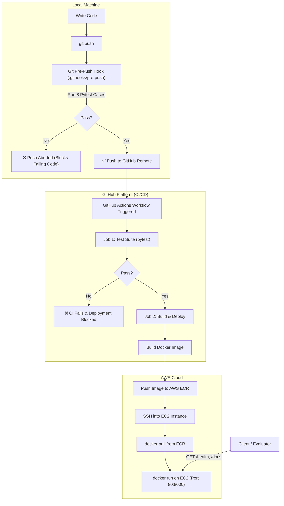

# Containerized Microservice on AWS (Project 1)

[](https://github.com/placeholder-user/cloud-assessment-microservice/actions)
[](https://www.python.org/)
[](https://www.docker.com/)
[](https://aws.amazon.com/)
[](tests/)

A production-ready containerized REST microservice built with **FastAPI**, containerized via **Docker**, pushed to **Amazon Elastic Container Registry (ECR)**, deployed on **Amazon EC2**, and automated with **GitHub Actions CI/CD** with **local & remote push blocking on test failure**.

---

## 1. Architecture Overview

### Runtime Architecture (`client → EC2 → container`)

```
+------------------+           HTTP (Port 80)           +------------------------------------------+
|                  | ---------------------------------> |                AWS Cloud                 |
|   Client / Web   |                                    |  +------------------------------------+  |
|  Browser / Postman| <--------------------------------- |  |         EC2 Virtual Machine        |  |
+------------------+          JSON Response             |  |                                    |  |
                                                        |  |    +--------------------------+    |  |
                                                        |  |    |  Docker Engine           |    |  |
                                                        |  |    |  +--------------------+  |    |  |
                                                        |  |    |  | Microservice       |  |    |  |
                                                        |  |    |  | Container (:8000)  |  |    |  |
                                                        |  |    |  | (FastAPI + Uvicorn)|  |    |  |
                                                        |  |    |  +--------------------+  |    |  |
                                                        |  |    +--------------------------+    |  |
                                                        |  +------------------------------------+  |
                                                        +------------------------------------------+
```

### Complete CI/CD & Deployment Pipeline



---

## 2. API Endpoints

The microservice includes interactive Swagger API documentation available at `/docs` or `/redoc`.

| Method | Endpoint | Description | Sample Response Code |
| :--- | :--- | :--- | :--- |
| `GET` | `/` | Microservice root & service metadata | `200 OK` |
| `GET` | `/health` | Target group / Load balancer health check | `200 OK` |
| `GET` | `/api/info` | Hostname, OS platform, Python version | `200 OK` |
| `GET` | `/api/items` | List items (supports `?status=pending` query) | `200 OK` |
| `GET` | `/api/items/{id}` | Retrieve specific item by ID | `200 OK` / `404 Not Found` |
| `POST` | `/api/items` | Create new item (Pydantic validation) | `201 Created` / `422 Unprocessable` |
| `DELETE` | `/api/items/{id}` | Delete item by ID | `200 OK` / `404 Not Found` |

---

## 3. Test Cases & Push-Blocking Mechanism

The project includes **8 automated test cases** (exceeding the required 4) under `tests/test_main.py`:

1. `test_health_check`: Validates `/health` returns status `healthy` and response code 200.
2. `test_root_endpoint`: Validates `/` returns metadata and service links.
3. `test_system_info_endpoint`: Validates `/api/info` returns container runtime details.
4. `test_list_items`: Validates `/api/items` returns seeded items collection.
5. `test_create_item_success`: Validates `POST /api/items` creates item and returns 201 Created.
6. `test_create_item_validation_error`: Validates `POST /api/items` rejects invalid payloads with 422.
7. `test_get_item_by_id_and_not_found`: Validates 200 for existing items and 404 for non-existent items.
8. `test_delete_item_success_and_not_found`: Validates deletion returns 200 and subsequent lookups return 404.

### Blocking Pushing of Failing Code

Push protection is enforced at two levels:

#### Level 1: Client-Side Git Pre-Push Hook
Configure the local hook:
```bash
./scripts/setup_hooks.sh
```
When you run `git push`, the hook in `.githooks/pre-push` automatically executes `pytest`. If any test fails:
```text
==========================================================
 [PRE-PUSH HOOK] FAILED! One or more tests did not pass.
 Push aborted to prevent breaking deployed microservice.
 Please fix the failing test cases before pushing.
==========================================================
error: failed to push some refs to '...'
```

#### Level 2: GitHub Actions CI Gate
The `.github/workflows/ci-cd.yml` workflow executes the test suite on every push and pull request. The `build-and-deploy` job depends on `needs: test`. If any test fails:
- The CI workflow fails immediately.
- Container build and AWS deployment are completely halted.

---

## 4. Steps to Reproduce Locally

### Option A: Local Python Environment
```bash
# 1. Clone repository
git clone <YOUR_REPO_URL>
cd Cloud_assessment

# 2. Create and activate virtual environment
python3 -m venv venv
source venv/bin/activate

# 3. Install dependencies
pip install -r requirements.txt

# 4. Set up pre-push hook
./scripts/setup_hooks.sh

# 5. Run automated tests
pytest -v tests/

# 6. Start development server
uvicorn app.main:app --reload --port 8000
```
Open [http://localhost:8000/docs](http://localhost:8000/docs) in your browser.

### Option B: Local Docker Run
```bash
# Build the Docker image
docker build -t cloud-microservice:latest .

# Run the container
docker run -d -p 8000:8000 --name cloud_app cloud-microservice:latest

# Check container health
curl http://localhost:8000/health
```

### Option C: Docker Compose
```bash
docker compose up --build -d
docker compose ps
docker compose logs -f
```

---

## 5. AWS ECR & EC2 Deployment Guide

### Step 1: Create AWS ECR Repository
```bash
aws ecr create-repository \
    --repository-name cloud-microservice \
    --region us-east-1
```
Note the repository URI, e.g.: `<AWS_ACCOUNT_ID>.dkr.ecr.us-east-1.amazonaws.com/cloud-microservice`.

### Step 2: Push Image to AWS ECR (Manual or CI/CD)
```bash
# Authenticate Docker to your ECR registry
aws ecr get-login-password --region us-east-1 | docker login --username AWS --password-stdin <AWS_ACCOUNT_ID>.dkr.ecr.us-east-1.amazonaws.com

# Tag and push image
docker tag cloud-microservice:latest <AWS_ACCOUNT_ID>.dkr.ecr.us-east-1.amazonaws.com/cloud-microservice:latest
docker push <AWS_ACCOUNT_ID>.dkr.ecr.us-east-1.amazonaws.com/cloud-microservice:latest
```

### Step 3: Launch EC2 Instance & Install Docker
1. Launch an EC2 instance (Amazon Linux 2023 or Ubuntu 22.04 LTS, `t2.micro` / `t3.micro` free tier).
2. Configure Security Group:
   - Port 22 (SSH) - Your IP
   - Port 80 (HTTP) - Anywhere (`0.0.0.0/0`)
   - Port 8000 (Custom TCP) - Anywhere (`0.0.0.0/0`)
3. Connect to your EC2 instance and run Docker bootstrap:
```bash
sudo yum update -y
sudo yum install -y docker
sudo systemctl enable --now docker
sudo usermod -aG docker ec2-user
```

### Step 4: Configure GitHub Secrets for Automatic CI/CD
In your GitHub repository, navigate to **Settings > Secrets and variables > Actions** and add:

| Secret Name | Value Description |
| :--- | :--- |
| `AWS_ACCESS_KEY_ID` | AWS IAM User access key with ECR access |
| `AWS_SECRET_ACCESS_KEY` | AWS IAM User secret key |
| `AWS_REGION` | e.g. `us-east-1` |
| `ECR_REPOSITORY` | `cloud-microservice` |
| `EC2_HOST` | Public IP or DNS of your EC2 instance |
| `EC2_USER` | `ec2-user` (or `ubuntu`) |
| `EC2_SSH_KEY` | Private SSH Key (`.pem` contents) |

Once configured, pushing changes to `main` automatically runs tests, builds the container, pushes to ECR, and deploys to EC2!

---

## 6. Class Presentation Cheat Sheet (2-3 Minutes)

Use this script during your presentation:

> **1. Introduction (30 seconds):**
> *"Hello everyone. For this cloud assessment, I built a containerized cloud microservice deployed on AWS using Docker, Amazon ECR, and an EC2 instance, fully orchestrated through GitHub Actions CI/CD."*

> **2. Architecture & Microservice Design (45 seconds):**
> *"The backend is implemented in FastAPI. When a client sends a request, it hits port 80 of our EC2 virtual machine, which forwards the traffic to our isolated Docker container running on port 8000. The microservice exposes a `/health` endpoint for uptime monitoring, an `/api/info` endpoint showcasing container isolation, and CRUD endpoints for data handling."*

> **3. Testing & CI/CD Push-Blocking (45 seconds):**
> *"To ensure reliability, I implemented 8 automated test cases covering health checks, CRUD operations, and error handling. Furthermore, I implemented a Git pre-push hook: whenever a developer attempts `git push`, the tests run locally; if any test fails, the push is immediately blocked. On GitHub, the Actions pipeline re-validates the test suite before building the Docker image and pushing it to Amazon ECR."*

> **4. Live Demo & Conclusion (30 seconds):**
> *"Here is the live deployment running on our EC2 instance at `http://<EC2-IP>/docs`. As you can see, the interactive Swagger documentation and health checks are live and responding in real-time."*
